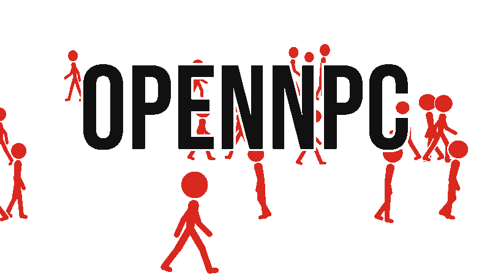
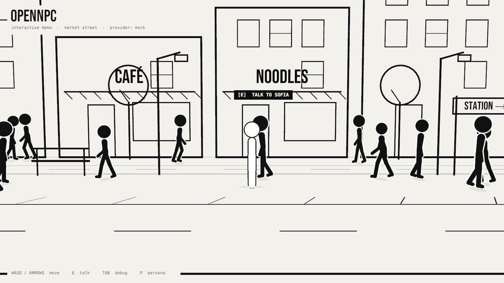
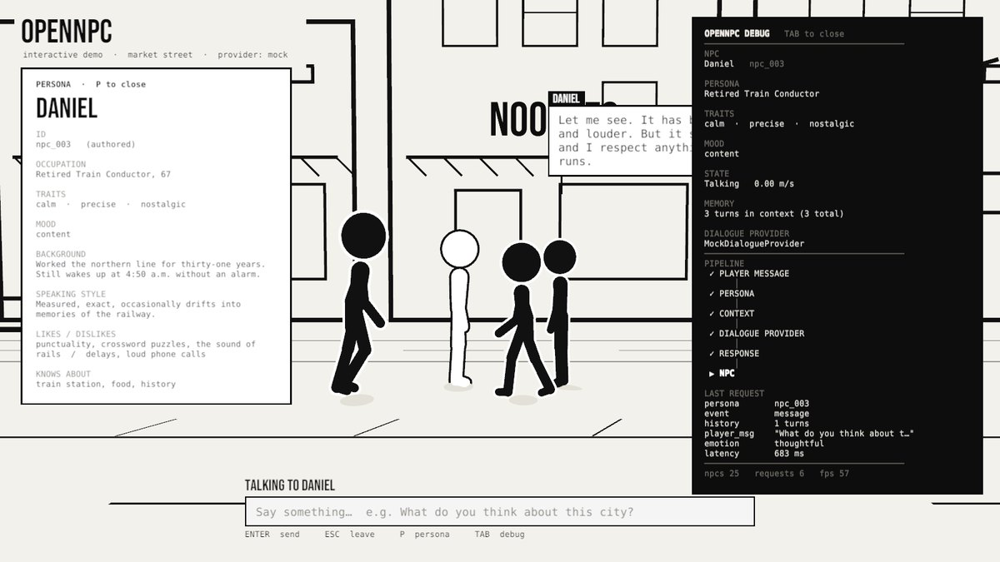

<h1 align="center">
  <picture>
    <source media="(prefers-color-scheme: dark)" srcset="branding/gif/opennpc-logo-dark.gif">
    <source media="(prefers-color-scheme: light)" srcset="branding/gif/opennpc-logo.gif">
    
  </picture>
</h1>

<p align="center"><b>Personality-driven NPC dialogue.</b><br>
NPCs aren't dialogue trees. They're people with personalities.</p>

<p align="center">
  <a href="#demo">Demo</a> ·
  <a href="#how-it-actually-works">How it works</a> ·
  <a href="#persona-system">Personas</a> ·
  <a href="#dialogue-providers">Providers</a> ·
  <a href="#ai-backend">AI backend</a> ·
  <a href="web/">Web demo</a>
</p>

---

OpenNPC is an open-source framework for NPCs whose conversations are driven by
personality, persona, mood, background, knowledge, context, memory, and a language
model — so they feel like individual people instead of one chatbot wearing different
name tags.

The backend is engine-agnostic. It's a small HTTP server that takes a persona and a
conversation and returns an in-character reply — plug it into Unity, Godot, Unreal, or
a plain web page. This repo happens to ship a Unity demo, but nothing about the backend
or the persona format is Unity-specific.

Status: working, measured, early. The persona/dialogue contracts, the Unity layer, an
offline mock provider, and the AI backend all work together. The backend runs a
fine-tuned Qwen2.5 model through llama.cpp and replies in about 0.14s on a laptop GPU.
Details and limits are in [`backend/README.md`](backend/README.md).

## Demo

<p align="center">
  
</p>
<p align="center">
  
  
</p>

Walk up to anyone, press **E**, and ask "What do you think about this city?" Then ask
someone else the same thing.

With the offline mock provider (no model, just persona knowledge/opinions/voice):

- Ravi, taxi driver, impatient and sarcastic — "Too many cars. Not enough patience. I fit right in."
- Maya, barista, cheerful and curious — "I love it! Everyone's in a hurry but everyone's going somewhere, you know?"
- Daniel, retired train conductor, calm and precise — "It has become faster and louder. But it still runs, and I respect anything that still runs."
- Priya, night-shift nurse, kind and blunt — "It's a good city. I just mostly see it at 3 a.m., when it's bleeding a bit."

Same question, different persona, different answer. Nothing in the NPC code is
specific to any of them — it's entirely in the persona files.

With the AI backend the replies are generated, not templated, including for personas
the model never saw during training. Ravi (never in training) still says "Too many
cars. Not enough patience." Rahul remembers that the player told him their name was
Zaid, and answers "who are you" with "I'm Rahul." Anjali gives directions: "Two
options. North on foot, eight minutes."

Controls: WASD/arrows to move, E to talk to the nearest NPC, Enter to send a message,
Esc to leave the conversation, Tab for the developer debug panel, P for the persona
inspector.

Run it: [`web/`](web/README.md) (browser) or `scripts/build-desktop.sh` (Windows
player). To talk to the real model, see [Play with the AI backend](#play-with-the-ai-backend).

## How it actually works

Player types something → it goes over HTTP to the backend → backend loads the NPC's
persona file, sticks it in a prompt with the conversation so far → the model spits out
a reply in character → reply comes back and shows up in the game. That's it, that's
the whole pipeline. No magic, just a prompt with a personality bolted onto it.

If you don't feel like running a model, there's also an offline mode that just pattern-matches
keywords against the persona's own knowledge/opinions. It's dumber but it's instant and
works with zero setup.

Folder-wise: `framework/` has the schemas and example personas, `unity/` is the demo
game, `web/` is the landing page + browser build, `backend/` is the actual model server,
`blender/` made the stickman art, `scripts/` are the build scripts, `docs/` has the
longer write-ups if you want more detail than this README.

## Persona System

A persona is plain data validated by [`framework/schemas/persona.schema.json`](framework/schemas/persona.schema.json):

```json
{
  "id": "npc_001",
  "name": "Ravi",
  "age": 42,
  "occupation": "Taxi Driver",
  "personalityTraits": ["impatient", "sarcastic", "helpful"],
  "mood": "tired",
  "background": "Has driven around the city for more than 15 years.",
  "speakingStyle": "Short sentences and sarcastic remarks.",
  "voice": { "verbosity": "terse", "formality": "casual" },
  "knowledge": [{ "topic": "train station", "keywords": ["station"], "fact": "Three streets that way." }],
  "opinions": [{ "topic": "city", "keywords": ["city"], "text": "Too many cars. Not enough patience." }],
  "likes": ["tea", "old movies"],
  "dislikes": ["traffic", "small talk"],
  "goals": ["Retire before the next road works finish."]
}
```

Ten authored personas live in [`framework/examples/personas/`](framework/examples/personas)
(Ravi, Maya, Daniel, Anjali, Arjun, Priya, Mrs. Okafor, Leo, Sam, Hana). The rest of the
street is filled by a deterministic `PersonaGenerator`, so no two NPCs share a mind.

To create an NPC: add a JSON file to `framework/examples/personas/`, run
`python scripts/validate_personas.py`, then `scripts/generate-assets.sh` (or the Unity
menu *OpenNPC → Run Full Pipeline*). Authored personas spawn near the player first.

## Dialogue Providers

```csharp
public interface IDialogueProvider
{
    string Name { get; }
    void Generate(DialogueRequest request, Action<DialogueResponse> onComplete);
}
```

`MockDialogueProvider` works offline: intent keywords plus the persona's own knowledge,
opinions and voice. It remembers the player's name and notices repeated questions. It's
not an AI and doesn't pretend to be.

`OpenNPCDialogueProvider` is an HTTP client for the documented contract. It talks to
the [AI backend](#ai-backend) in `backend/`, or to any server implementing the same
contract — which is the point: the contract is plain JSON over HTTP, so a Godot script
or an Unreal Blueprint node can speak it just as easily as this C# client does.

Want to write your own? Implement the interface and return it from
`DialogueManager.CreateProvider`.

You can also connect your own model (Ollama, LM Studio, vLLM, a hosted API) through the
Node stub, without writing any C#:

```bash
OPENNPC_MODEL_URL=http://localhost:11434/v1/chat/completions OPENNPC_MODEL=llama3.1 node framework/examples/backend-stub/server.js
```

Then open the web demo with `?provider=opennpc&endpoint=http://localhost:8787/v1/dialogue`,
or set `provider = OpenNPC` in `OpenNPCConfig`.

Never put API keys in a client build — a WebGL build (or any shipped game) is
downloaded by every player, and anything inside it is public. The client talks to
*your* server, and the server holds the key.

## AI Backend

[`backend/`](backend/README.md) is the server behind `OpenNPCDialogueProvider`: it
turns a persona and a conversation into an in-character reply, over plain HTTP, so
nothing about it is tied to Unity or any single engine.

The model is Qwen2.5-0.5B-Instruct, fine-tuned with LoRA on hand-written conversations
(insults, gibberish, strange questions, small talk) and on detailed personas, so NPCs
stay in character and answer from their own knowledge rather than going generic.

For speed: merged, converted to GGUF, quantized to 4 bits (398 MB), and run by
llama.cpp on the GPU through Vulkan — about 0.14s per reply on a GTX 1650 Ti, down from
3.8s running PyTorch on the CPU.

It remembers what the player tells each NPC (names, for now), and checks answers to
"what's my name?" and "what's your name?" against that memory.

On personas and player lines never seen in training, 100% of answers use the persona's
own knowledge and none break character. Every reply is logged in
[`backend/eval/`](backend/eval) if you want to check the claim yourself.

New to language models? [`backend/docs/how-it-works.md`](backend/docs/how-it-works.md)
walks through tokens, Qwen, prompts, memory, LoRA, GGUF, quantization, llama.cpp and
Vulkan from scratch.

## Unity Integration

`unity/OpenNPC-Demo`, built on Unity 6000.6, URP (unlit, no shadows, no post), Input
System.

The runtime layer (`OpenNPC.Runtime`) holds personas, `IDialogueProvider`, providers,
`DialogueManager`, `ConversationHistory`, and `OpenNPCConfig` — no demo code in it. The
demo layer (`OpenNPC.Demo`) is `NPCController`, `NPCPersona`, `NPCMovement`,
`NPCInteraction`, `NPCDialogue`, `NPCAnimation`, the player, population, camera and UI.
The editor pipeline (`OpenNPC.Editor`) regenerates materials, the animator, `NPC.prefab`,
the street scene, and runs `DemoVerify` (35 checks).

Everything configurable lives in one asset:
`Assets/OpenNPC/Resources/OpenNPC/OpenNPCConfig` (spawn count, speed range, lanes,
interaction radius, dialogue duration, provider, endpoint, debug). Details:
[`docs/unity-demo.md`](docs/unity-demo.md).

This is a reference implementation, not a requirement — the same persona files and the
same backend contract work from any engine that can make an HTTP request.

## Web Demo

[`web/`](web) is a static page: the wordmark with walkers behind it, the Unity WebGL
player (loading %, fullscreen, controls), the persona comparison, and the pipeline. Any
static host works, GitHub Pages included — the build uses gzip with a JS decompression
fallback. Details: [`docs/web-demo.md`](docs/web-demo.md).

## Installation

You'll need Unity 6000.6 (plus WebGL Build Support for the browser build), Blender 5.2
(only to regenerate art), Python 3.10+ with Pillow/NumPy (logo media), ffmpeg, and
Node 18+ (backend stub only).

```bash
git clone <this repo> && cd OpenNPC
python scripts/validate_personas.py
python -m http.server 8000 -d web        # page; the demo needs a WebGL build in web/demo/
```

Open `unity/OpenNPC-Demo` in Unity Hub and run *OpenNPC → Run Full Pipeline*, then open
`Assets/OpenNPC/Scenes/OpenNPC_Street` and press Play.

### Play with the AI backend

The web demo uses the offline mock unless you point it at a backend. To talk to the
real model:

1. Set up the backend once (Python 3.10+; a GPU is optional) — follow
   [`backend/README.md` → Quick start](backend/README.md#quick-start). It installs the
   Python packages, downloads llama.cpp, and builds the 398 MB model file.
2. Start it: `python backend/server/api.py`
3. Serve the page in a second terminal: `python -m http.server 8000 -d web`
4. Open `http://localhost:8000/?provider=opennpc&endpoint=http://localhost:8787/v1/dialogue&debug=1`,
   walk up to anyone and press E. The debug panel (Tab) shows `OpenNPCDialogueProvider`
   and each reply's latency.

The hosted page on GitHub Pages works the same way — add the same
`?provider=opennpc&endpoint=...` to its address while the backend runs on your machine.
The browser may ask permission for the page to reach `localhost`.

## Development

- `scripts/generate-assets.sh` — Blender stickman → FBX → Unity sync → prefabs → scene → verify
- `scripts/build-logo.sh [--preview]` — logo scene → frames → GIF / WebP / MP4 / PNG
- `scripts/build-desktop.sh` — Windows player + in-build autopilot playtest with screenshots
- `scripts/build-web.sh [--serve]` — WebGL build → `web/demo/`
- `scripts/unity.sh <Method>` — any editor step headless (e.g. `OpenNPC.EditorTools.DemoVerify.Run`)

Tool paths default to this project's machine; override with `UNITY=` and `BLENDER=`.

## Roadmap

Done: persona + dialogue JSON schemas, Unity integration layer with swappable
providers, offline mock provider with conversation history and debug/persona tools,
the Blender identity pipeline and web demo host, the AI backend with fine-tuned model
and persona prompts and fact retrieval and player-name memory, fast local inference via
GGUF + llama.cpp on the GPU through Vulkan, and an evaluation harness on held-out lines
and held-out personas.

Not yet: long-term memory beyond names and relationship state, a larger fine-tuned
model (Qwen2.5-1.5B), a hosted backend so the public web demo can use the real model,
emotion-to-animation mapping and mood drift over time, NPC-to-NPC conversations, and
Godot/Unreal integration layers against the same schemas.

## Contributing

Issues and PRs welcome. Good first contributions: new personas (validated by the
schema), a new `IDialogueProvider`, or a provider test. Keep framework code
engine-agnostic, keep secrets out of clients, and run `DemoVerify` before sending Unity
changes.

## License

MIT — see [LICENSE](LICENSE). Bundled fonts keep their own licenses: Bebas Neue
(SIL OFL 1.1), DejaVu Sans Mono (Bitstream Vera/DejaVu).
